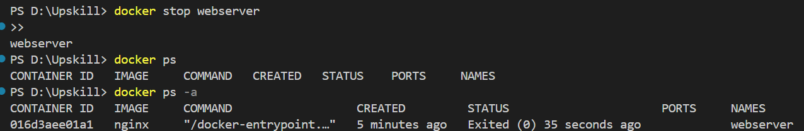

*Run a docker image; if does not exist, a new one is created; listens at 8080, called webserver*
docker run -d -p 8080:80 --name webserver nginx
*where webserver running instance name of the image*

docker ps

docker images

*Attach image to a container and run*
docker container exec -it webserver bash

docker stop webserver

*deletes running instance*

docker rm nginx
*deletes associated image*

### Building containers using a Dockerfile
